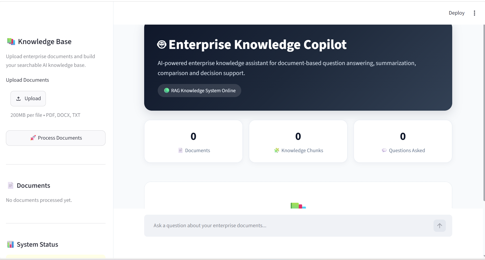

# 🤖 AI Enterprise Knowledge Intelligence & Decision Copilot

An AI-powered Enterprise Knowledge Copilot that allows employees to
upload business documents and ask questions using Retrieval-Augmented
Generation (RAG).

## 📌 Project Overview

The system processes enterprise documents such as HR policies,
IT security policies, reports, and guidelines.

Users can ask natural-language questions and receive answers based
on the uploaded documents with source references.

## ✨ Key Features

- 📄 Upload PDF, DOCX, and TXT documents
- 🔍 Retrieval-Augmented Generation (RAG)
- 🤖 AI-powered question answering
- 📚 Source and document references
- 💬 Conversational context for follow-up questions
- 📊 Document summarization
- ⚖️ Document comparison
- ✅ Action-item generation
- 💡 Recommendation support
- 🚫 Reduces unsupported answers using document-grounded responses
- 🎨 Professional Streamlit user interface

## 🧠 System Architecture

```text
User
  ↓
Streamlit UI
  ↓
Document Upload
  ↓
Document Processing
  ↓
Text Extraction
  ↓
Text Chunking
  ↓
Gemini Embeddings
  ↓
Vector Similarity Search
  ↓
Relevant Document Chunks
  ↓
Gemini Generative Model
  ↓
Grounded Answer
  ↓
Source References

## 📸 Application Screenshots

### Main Interface



### Main Interface


